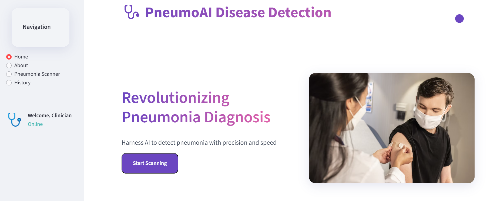
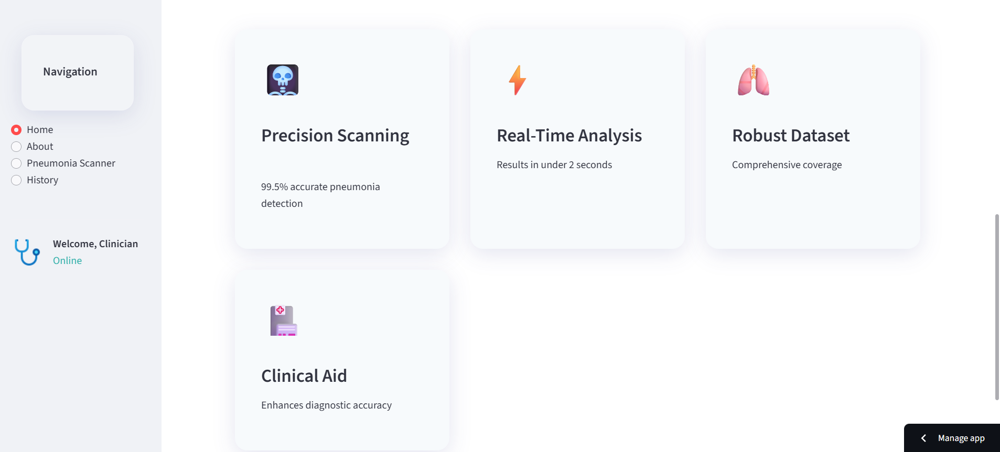
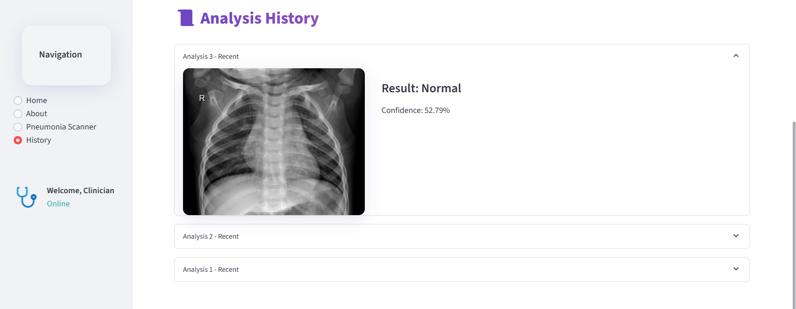
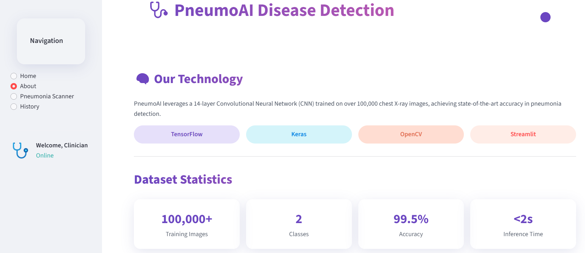
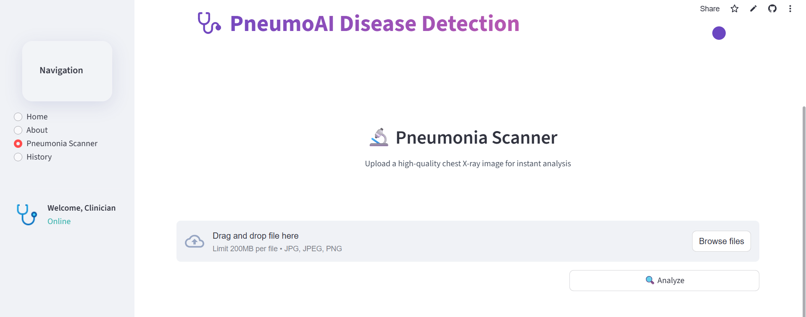

# Pneumonia Detection from Chest X-rays

## User Interface

### Home page

### History Page

### About Page

### Prediction Page

A web application that uses deep learning to detect pneumonia from chest X-ray images with immediate results.

## 🚀 Live Demo

Access the live application at:  
[https://pneumonia-disease-detection-pq6uasvt2udprbadhnblrh.streamlit.app/](https://pneumonia-disease-detection-pq6uasvt2udprbadhnblrh.streamlit.app/)

## ✨ Features

- 🖼️ Upload chest X-ray images (JPEG/PNG)
- 🤖 AI-powered pneumonia detection
- ⚡ Real-time prediction results
- 📊 Probability scores for transparency
- 🎯 Simple, intuitive interface

## 🛠️ How It Works

1. **Upload** a chest X-ray image
2. The system **analyzes** the image using a trained deep learning model
3. Receive **instant results** indicating:
   - Normal (healthy) 
   - Pneumonia detected
4. View the **confidence level** of the prediction

## 🧠 Technical Details

- **Framework**: Streamlit (Python web app)
- **Deep Learning**: TensorFlow/Keras model
- **Model Architecture**: Convolutional Neural Network (CNN)
- **Training Data**: Chest X-ray images from public datasets
- **Deployment**: Streamlit Community Cloud
